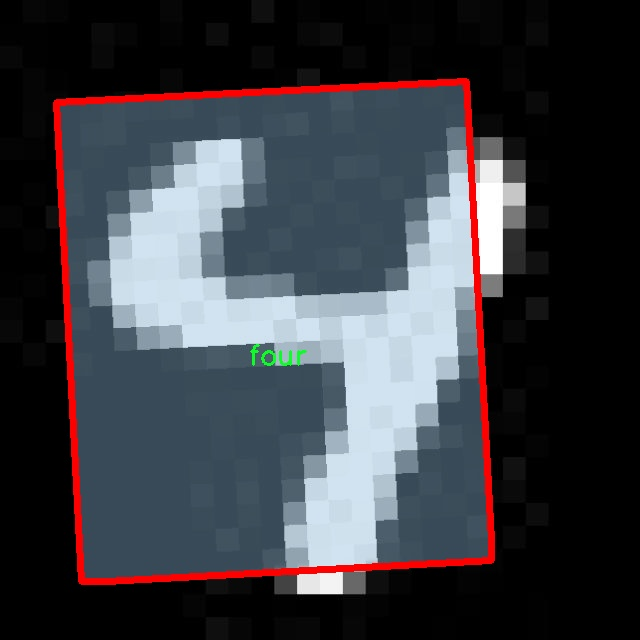

# 手写数字识别系统： yolov8-seg-C2f-EMBC

### 1.研究背景与意义

[参考博客](https://gitee.com/YOLOv8_YOLOv11_Segmentation_Studio/projects)

[博客来源](https://kdocs.cn/l/cszuIiCKVNis)

研究背景与意义

手写数字识别作为计算机视觉和模式识别领域的重要研究方向，近年来受到了广泛关注。随着深度学习技术的快速发展，尤其是卷积神经网络（CNN）的成功应用，手写数字识别的准确性和效率得到了显著提升。YOLO（You Only Look Once）系列模型因其实时性和高效性，成为目标检测领域的热门选择。YOLOv8作为该系列的最新版本，结合了更为先进的特征提取和处理机制，为手写数字识别提供了新的可能性。

在实际应用中，手写数字识别不仅仅局限于学术研究，它在银行支票处理、邮政编码识别、表单自动化等多个领域都有着广泛的应用需求。传统的手写数字识别方法往往依赖于特征工程，难以适应多样化的手写风格和复杂的背景干扰。而基于YOLOv8的改进模型，能够通过深度学习自动提取特征，显著提高识别的准确性和鲁棒性。

本研究所使用的数据集“number0418”包含2800张手写数字图像，涵盖了16个类别，包括从0到9的数字以及一些特殊形状（如圆形、直线等）。这些类别的多样性为模型的训练提供了丰富的样本，有助于提高模型对不同手写风格的适应能力。数据集的设计考虑到了手写数字的多样性和复杂性，使得模型在训练过程中能够学习到更为全面的特征，从而提升其在实际应用中的表现。

通过对YOLOv8模型的改进，本研究旨在实现更高效的手写数字识别系统。改进的方向包括优化网络结构、调整损失函数以及增强数据预处理等。具体而言，研究将探索如何通过引入更深层次的卷积层和改进的激活函数，提升模型对复杂背景和不同书写风格的适应能力。此外，针对数据集中的特定类别，研究还将采用数据增强技术，以扩展训练样本的多样性，进一步提高模型的泛化能力。

手写数字识别系统的研究不仅具有理论意义，还有着重要的实际应用价值。随着数字化进程的加快，自动化处理手写信息的需求日益增加。一个高效、准确的手写数字识别系统能够极大地提高数据处理的效率，降低人工成本，提升用户体验。尤其是在教育、金融、物流等行业，手写数字识别技术的应用将推动这些领域的智能化转型。

综上所述，基于改进YOLOv8的手写数字识别系统的研究，不仅是对现有技术的延续和发展，更是对未来智能识别技术的探索。通过深入分析和优化手写数字识别的各个环节，本研究将为相关领域提供新的思路和方法，推动手写数字识别技术的进一步发展。

### 2.图片演示


注意：本项目提供完整的训练源码数据集和训练教程,由于此博客编辑较早,暂不提供权重文件（best.pt）,需要按照6.训练教程进行训练后实现上图效果。

### 3.视频演示

[3.1 视频演示](https://www.bilibili.com/video/BV1H86AYHECM/)

### 4.数据集信息

##### 4.1 数据集类别数＆类别名

nc: 10
names: ['eight', 'five', 'four', 'nine', 'one', 'seven', 'six', 'three', 'two', 'zero']


##### 4.2 数据集信息简介

数据集信息展示

在本研究中，我们采用了名为“number0418”的数据集，以训练和改进YOLOv8-seg手写数字识别系统。该数据集专注于手写数字的识别，涵盖了10个类别，分别是：零（zero）、一（one）、二（two）、三（three）、四（four）、五（five）、六（six）、七（seven）、八（eight）和九（nine）。这些类别不仅代表了数字的基本形式，还反映了手写体在不同书写风格和个体差异下的多样性。

“number0418”数据集的构建旨在提供一个丰富且多样化的样本库，以便于训练深度学习模型，尤其是针对手写数字的图像识别任务。数据集中包含的每个类别都经过精心挑选，确保其在不同的书写风格、笔画粗细和书写速度下的表现，进而增强模型的泛化能力。这种多样性对于提升YOLOv8-seg在实际应用中的识别准确率至关重要，因为手写数字的识别常常受到个体书写习惯的影响。

在数据集的收集过程中，研究团队采用了多种手段，以确保数据的质量和代表性。样本的获取不仅包括了来自不同年龄段和文化背景的书写者，还涵盖了各种书写工具的使用，如钢笔、铅笔和马克笔等。这种多样化的样本来源使得“number0418”数据集在训练过程中能够有效模拟现实世界中可能遇到的各种情况，从而提高模型的鲁棒性。

此外，数据集中的每个样本都经过了标注，以确保模型在训练时能够准确识别每个数字的类别。标注过程遵循严格的标准，确保每个样本的标签与其实际内容相符。这种精确的标注不仅有助于提升模型的学习效率，也为后续的模型评估提供了可靠的依据。

在数据预处理阶段，研究团队对图像进行了标准化处理，包括调整图像尺寸、归一化像素值等，以适应YOLOv8-seg模型的输入要求。这些预处理步骤旨在减少数据噪声，提高模型的训练效果。经过处理的数据集将被分为训练集、验证集和测试集，以便于对模型的性能进行全面评估。

总之，“number0418”数据集为手写数字识别系统的训练提供了一个坚实的基础。通过丰富的样本和精确的标注，该数据集不仅有助于提升YOLOv8-seg模型的识别准确率，还为未来的研究提供了重要的参考。随着手写数字识别技术的不断发展，数据集的多样性和质量将成为推动这一领域进步的关键因素。我们期待通过对“number0418”数据集的深入研究，能够在手写数字识别的准确性和效率上取得更大的突破。





### 5.项目依赖环境部署教程（零基础手把手教学）

[5.1 环境部署教程链接（零基础手把手教学）](https://www.bilibili.com/video/BV1jG4Ve4E9t/?vd_source=bc9aec86d164b67a7004b996143742dc)


[5.2 安装Python虚拟环境创建和依赖库安装视频教程链接（零基础手把手教学）](https://www.bilibili.com/video/BV1nA4VeYEze/?vd_source=bc9aec86d164b67a7004b996143742dc)

### 6.手把手YOLOV8-seg训练视频教程（零基础手把手教学）

[6.1 手把手YOLOV8-seg训练视频教程（零基础小白有手就能学会）](https://www.bilibili.com/video/BV1cA4VeYETe/?vd_source=bc9aec86d164b67a7004b996143742dc)


按照上面的训练视频教程链接加载项目提供的数据集，运行train.py即可开始训练



     Epoch   gpu_mem       box       obj       cls    labels  img_size
     1/200     0G   0.01576   0.01955  0.007536        22      1280: 100%|██████████| 849/849 [14:42<00:00,  1.04s/it]
               Class     Images     Labels          P          R     mAP@.5 mAP@.5:.95: 100%|██████████| 213/213 [01:14<00:00,  2.87it/s]
                 all       3395      17314      0.994      0.957      0.0957      0.0843

     Epoch   gpu_mem       box       obj       cls    labels  img_size
     2/200     0G   0.01578   0.01923  0.007006        22      1280: 100%|██████████| 849/849 [14:44<00:00,  1.04s/it]
               Class     Images     Labels          P          R     mAP@.5 mAP@.5:.95: 100%|██████████| 213/213 [01:12<00:00,  2.95it/s]
                 all       3395      17314      0.996      0.956      0.0957      0.0845

     Epoch   gpu_mem       box       obj       cls    labels  img_size
     3/200     0G   0.01561    0.0191  0.006895        27      1280: 100%|██████████| 849/849 [10:56<00:00,  1.29it/s]
               Class     Images     Labels          P          R     mAP@.5 mAP@.5:.95: 100%|███████   | 187/213 [00:52<00:00,  4.04it/s]
                 all       3395      17314      0.996      0.957      0.0957      0.0845


### 7.50+种全套YOLOV8-seg创新点加载调参实验视频教程（一键加载写好的改进模型的配置文件）

[7.1 50+种全套YOLOV8-seg创新点加载调参实验视频教程（一键加载写好的改进模型的配置文件）](https://www.bilibili.com/video/BV1Hw4VePEXv/?vd_source=bc9aec86d164b67a7004b996143742dc)

### YOLOV8-seg算法简介

原始YOLOV8-seg算法原理

YOLOv8-seg算法是YOLO系列中的最新版本，继承了YOLO系列的单阶段检测框架，并在此基础上进行了显著的改进和优化，特别是在目标检测和分割任务的结合上。YOLOv8-seg不仅关注目标的检测，还通过引入分割模块，实现了对目标的精确边界提取，从而在计算机视觉领域中展现出更为强大的性能。

YOLOv8-seg的网络结构主要由四个部分组成：输入模块、Backbone骨干网络、Neck特征融合网络和Head检测模块。输入模块负责对输入图像进行预处理，包括图像的尺寸调整、数据增强（如Mosaic增强和随机扰动）等，以确保网络能够在多样化的输入条件下保持良好的性能。此过程不仅提高了模型的鲁棒性，还增强了其对不同场景的适应能力。

在Backbone部分，YOLOv8-seg采用了C2f模块替代了传统的C3模块。C2f模块通过引入更多的分支结构，增强了梯度流动，确保了特征的丰富性和多样性。这种设计使得网络在特征提取时能够更好地捕捉到图像中的细节信息，从而为后续的特征融合和目标检测提供了更为坚实的基础。通过这种方式，YOLOv8-seg能够有效地处理不同尺度的目标，提升了检测精度。

Neck部分采用了FPN（特征金字塔网络）和PAN（路径聚合网络）的结合，进一步促进了多尺度特征的融合。FPN负责从不同层次提取特征，并通过上采样将低层特征与高层特征进行结合，从而增强了语义信息的传递。而PAN则通过路径聚合的方式，确保了特征在不同层次之间的有效流动。这种结构的优势在于，它能够更好地捕捉到目标的上下文信息，进而提升对复杂场景中目标的检测和分割能力。

在Head检测模块中，YOLOv8-seg采用了解耦头结构，将分类和定位任务分开处理。通过这种方式，网络能够更加专注于每个任务的特征提取，从而加速模型的收敛并提高检测精度。解耦头结构的引入，使得YOLOv8-seg在处理复杂场景时，能够更好地平衡目标的分类和定位任务，从而实现更高的检测性能。

此外，YOLOv8-seg在标签分配策略上也进行了创新。与以往的YOLO版本不同，YOLOv8-seg采用了动态标签分配策略，能够根据目标的实际情况动态调整正负样本的匹配。这种策略不仅提高了模型对不同目标的适应能力，还有效降低了因样本不均衡带来的负面影响。通过这种方式，YOLOv8-seg能够更好地处理复杂场景中的目标检测和分割任务，提升了整体性能。

在损失函数的设计上，YOLOv8-seg引入了Varifocal Loss和CIoU Loss等多种损失函数，旨在更精确地衡量模型的分类和定位性能。Varifocal Loss通过对正负样本进行加权，使得模型在训练过程中更加关注高质量的正样本，从而提升了模型的检测精度。而CIoU Loss则通过考虑目标的中心点、宽高比等多个因素，进一步优化了目标的定位性能。这种多样化的损失函数设计，使得YOLOv8-seg在训练过程中能够更好地平衡分类和定位任务，从而实现更高的检测精度。

总的来说，YOLOv8-seg算法通过对传统YOLO结构的优化与创新，结合了目标检测与分割的能力，展现出在复杂场景下的强大性能。其独特的网络结构设计、动态标签分配策略以及多样化的损失函数，使得YOLOv8-seg在计算机视觉领域中具备了更为广泛的应用潜力。无论是在自动驾驶、安防监控还是医疗影像分析等领域，YOLOv8-seg都能够为实际应用提供高效、精准的解决方案，推动计算机视觉技术的进一步发展。


### 9.系统功能展示（检测对象为举例，实际内容以本项目数据集为准）

图9.1.系统支持检测结果表格显示

  图9.2.系统支持置信度和IOU阈值手动调节

  图9.3.系统支持自定义加载权重文件best.pt(需要你通过步骤5中训练获得)

  图9.4.系统支持摄像头实时识别

  图9.5.系统支持图片识别

  图9.6.系统支持视频识别

  图9.7.系统支持识别结果文件自动保存

  图9.8.系统支持Excel导出检测结果数据


### 10.50+种全套YOLOV8-seg创新点原理讲解（非科班也可以轻松写刊发刊，V11版本正在科研待更新）

#### 10.1 由于篇幅限制，每个创新点的具体原理讲解就不一一展开，具体见下列网址中的创新点对应子项目的技术原理博客网址【Blog】：


[10.1 50+种全套YOLOV8-seg创新点原理讲解链接](https://gitee.com/qunmasj/good)

#### 10.2 部分改进模块原理讲解(完整的改进原理见上图和技术博客链接)【如果此小节的图加载失败可以通过CSDN或者Github搜索该博客的标题访问原始博客，原始博客图片显示正常】
### YOLOv8简介
#### Neck模块设计
骨干网络和 Neck 的具体变化为：

第一个卷积层的 kernel 从 6x6 变成了 3x3
所有的 C3 模块换成 C2f，结构如下所示，可以发现多了更多的跳层连接和额外的 Split 操作


去掉了 Neck 模块中的 2 个卷积连接层
Backbone 中 C2f 的 block 数从 3-6-9-3 改成了 3-6-6-3
查看 N/S/M/L/X 等不同大小模型，可以发现 N/S 和 L/X 两组模型只是改了缩放系数，但是 S/M/L 等骨干网络的通道数设置不一样，没有遵循同一套缩放系数。如此设计的原因应该是同一套缩放系数下的通道设置不是最优设计，YOLOv7 网络设计时也没有遵循一套缩放系数作用于所有模型。

#### Head模块设计
Head 部分变化最大，从原先的耦合头变成了解耦头，并且从 YOLOv5 的 Anchor-Based 变成了 Anchor-Free。其结构如下所示：


可以看出，不再有之前的 objectness 分支，只有解耦的分类和回归分支，并且其回归分支使用了 Distribution Focal Loss 中提出的积分形式表示法。

#### Loss 计算
Loss 计算过程包括 2 个部分： 正负样本分配策略和 Loss 计算。 现代目标检测器大部分都会在正负样本分配策略上面做文章，典型的如 YOLOX 的 simOTA、TOOD 的 TaskAlignedAssigner 和 RTMDet 的 DynamicSoftLabelAssigner，这类 Assigner 大都是动态分配策略，而 YOLOv5 采用的依然是静态分配策略。考虑到动态分配策略的优异性，YOLOv8 算法中则直接引用了 TOOD 的 TaskAlignedAssigner。 TaskAlignedAssigner 的匹配策略简单总结为： 根据分类与回归的分数加权的分数选择正样本。

s 是标注类别对应的预测分值，u 是预测框和 gt 框的 iou，两者相乘就可以衡量对齐程度。

对于每一个 GT，对所有的预测框基于 GT 类别对应分类分数，预测框与 GT 的 IoU 的加权得到一个关联分类以及回归的对齐分数 alignment_metrics 。
对于每一个 GT，直接基于 alignment_metrics 对齐分数选取 topK 大的作为正样本
Loss 计算包括 2 个分支： 分类和回归分支，没有了之前的 objectness 分支。
分类分支依然采用 BCE Loss
回归分支需要和 Distribution Focal Loss 中提出的积分形式表示法绑定，因此使用了 Distribution Focal Loss， 同时还使用了 CIoU Loss
Loss 采用一定权重比例加权即可。
#### 训练数据增强
数据增强方面和 YOLOv5 差距不大，只不过引入了 YOLOX 中提出的最后 10 个 epoch 关闭 Mosaic 的操作。假设训练 epoch 是 500，其示意图如下所示：

### RCS-OSA的基本原理
参考该博客，RCSOSA（RCS-One-Shot Aggregation）是RCS-YOLO中提出的一种结构，我们可以将主要原理概括如下：

1. RCS（Reparameterized Convolution based on channel Shuffle）: 结合了通道混洗，通过重参数化卷积来增强网络的特征提取能力。

2. RCS模块: 在训练阶段，利用多分支结构学习丰富的特征表示；在推理阶段，通过结构化重参数化简化为单一分支，减少内存消耗。

3. OSA（One-Shot Aggregation）: 一次性聚合多个特征级联，减少网络计算负担，提高计算效率。

4. 特征级联: RCS-OSA模块通过堆叠RCS，确保特征的复用并加强不同层之间的信息流动。

#### RCS
RCS（基于通道Shuffle的重参数化卷积）是RCS-YOLO的核心组成部分，旨在训练阶段通过多分支结构学习丰富的特征信息，并在推理阶段通过简化为单分支结构来减少内存消耗，实现快速推理。此外，RCS利用通道分割和通道Shuffle操作来降低计算复杂性，同时保持通道间的信息交换，这样在推理阶段相比普通的3×3卷积可以减少一半的计算复杂度。通过结构重参数化，RCS能够在训练阶段从输入特征中学习深层表示，并在推理阶段实现快速推理，同时减少内存消耗。

#### RCS模块
RCS（基于通道Shuffle的重参数化卷积）模块中，结构在训练阶段使用多个分支，包括1x1和3x3的卷积，以及一个直接的连接（Identity），用于学习丰富的特征表示。在推理阶段，结构被重参数化成一个单一的3x3卷积，以减少计算复杂性和内存消耗，同时保持训练阶段学到的特征表达能力。这与RCS的设计理念紧密相连，即在不牺牲性能的情况下提高计算效率。


上图为大家展示了RCS的结构，分为训练阶段（a部分）和推理阶段（b部分）。在训练阶段，输入通过通道分割，一部分输入经过RepVGG块，另一部分保持不变。然后通过1x1卷积和3x3卷积处理RepVGG块的输出，与另一部分输入进行通道Shuffle和连接。在推理阶段，原来的多分支结构被简化为一个单一的3x3 RepConv块。这种设计允许在训练时学习复杂特征，在推理时减少计算复杂度。黑色边框的矩形代表特定的模块操作，渐变色的矩形代表张量的特定特征，矩形的宽度代表张量的通道数。 

#### OSA
OSA（One-Shot Aggregation）是一个关键的模块，旨在提高网络在处理密集连接时的效率。OSA模块通过表示具有多个感受野的多样化特征，并在最后的特征映射中仅聚合一次所有特征，从而克服了DenseNet中密集连接的低效率问题。

OSA模块的使用有两个主要目的：

1. 提高特征表示的多样性：OSA通过聚合具有不同感受野的特征来增加网络对于不同尺度的敏感性，这有助于提升模型对不同大小目标的检测能力。

2. 提高效率：通过在网络的最后一部分只进行一次特征聚合，OSA减少了重复的特征计算和存储需求，从而提高了网络的计算和能源效率。

在RCS-YOLO中，OSA模块被进一步与RCS（基于通道Shuffle的重参数化卷积）相结合，形成RCS-OSA模块。这种结合不仅保持了低成本的内存消耗，而且还实现了语义信息的有效提取，对于构建轻量级和大规模的对象检测器尤为重要。

下面我将为大家展示RCS-OSA（One-Shot Aggregation of RCS）的结构。


在RCS-OSA模块中，输入被分为两部分，一部分直接通过，另一部分通过堆叠的RCS模块进行处理。处理后的特征和直接通过的特征在通道混洗（Channel Shuffle）后合并。这种结构设计用于增强模型的特征提取和利用效率，是RCS-YOLO架构中的一个关键组成部分旨在通过一次性聚合来提高模型处理特征的能力，同时保持计算效率。

#### 特征级联
特征级联（feature cascade）是一种技术，通过在网络的一次性聚合（one-shot aggregate）路径上维持有限数量的特征级联来实现的。在RCS-YOLO中，特别是在RCS-OSA（RCS-Based One-Shot Aggregation）模块中，只保留了三个特征级联。

特征级联的目的是为了减轻网络计算负担并降低内存占用。这种方法可以有效地聚合不同层次的特征，提高模型的语义信息提取能力，同时避免了过度复杂化网络结构所带来的低效率和高资源消耗。

下面为大家提供的图像展示的是RCS-YOLO的整体架构，其中包括RCS-OSA模块。RCS-OSA在模型中用于堆叠RCS模块，以确保特征的复用并加强不同层之间的信息流动。图中显示的多层RCS-OSA模块的排列和组合反映了它们如何一起工作以优化特征传递和提高检测性能。


总结：RCS-YOLO主要由RCS-OSA（蓝色模块）和RepVGG（橙色模块）构成。这里的n代表堆叠RCS模块的数量。n_cls代表检测到的对象中的类别数量。图中的IDetect是从YOLOv7中借鉴过来的，表示使用二维卷积神经网络的检测层。这个架构通过堆叠的RCS模块和RepVGG模块，以及两种类型的检测层，实现了对象检测的任务。 


### 11.项目核心源码讲解（再也不用担心看不懂代码逻辑）

#### 11.1 ultralytics\nn\extra_modules\attention.py

以下是对代码中最核心部分的提取和详细注释。代码主要实现了一些深度学习模型中的注意力机制和卷积操作。为了简化，以下只保留了部分重要的类和方法。

```python
import torch
from torch import nn
import torch.nn.functional as F

class EMA(nn.Module):
    """
    Exponential Moving Average (EMA) Module
    用于计算输入特征的指数移动平均，增强特征表示。
    """
    def __init__(self, channels, factor=8):
        super(EMA, self).__init__()
        self.groups = factor
        assert channels // self.groups > 0
        self.softmax = nn.Softmax(-1)
        self.agp = nn.AdaptiveAvgPool2d((1, 1))
        self.pool_h = nn.AdaptiveAvgPool2d((None, 1))
        self.pool_w = nn.AdaptiveAvgPool2d((1, None))
        self.gn = nn.GroupNorm(channels // self.groups, channels // self.groups)
        self.conv1x1 = nn.Conv2d(channels // self.groups, channels // self.groups, kernel_size=1)
        self.conv3x3 = nn.Conv2d(channels // self.groups, channels // self.groups, kernel_size=3, padding=1)

    def forward(self, x):
        b, c, h, w = x.size()
        group_x = x.reshape(b * self.groups, -1, h, w)  # 重新调整形状以进行分组处理
        x_h = self.pool_h(group_x)  # 对每个组进行高度池化
        x_w = self.pool_w(group_x).permute(0, 1, 3, 2)  # 对每个组进行宽度池化并转置
        hw = self.conv1x1(torch.cat([x_h, x_w], dim=2))  # 合并并通过1x1卷积
        x_h, x_w = torch.split(hw, [h, w], dim=2)  # 分割回高度和宽度
        x1 = self.gn(group_x * x_h.sigmoid() * x_w.permute(0, 1, 3, 2).sigmoid())  # 应用组归一化
        x2 = self.conv3x3(group_x)  # 通过3x3卷积
        # 计算权重
        weights = (self.softmax(self.agp(x1).reshape(b * self.groups, -1, 1).permute(0, 2, 1)) @ 
                   x2.reshape(b * self.groups, c // self.groups, -1)).reshape(b * self.groups, 1, h, w)
        return (group_x * weights.sigmoid()).reshape(b, c, h, w)  # 返回加权后的特征

class SimAM(nn.Module):
    """
    SimAM (Similarity Attention Module)
    用于计算相似性注意力，增强特征表示。
    """
    def __init__(self, e_lambda=1e-4):
        super(SimAM, self).__init__()
        self.activaton = nn.Sigmoid()  # 激活函数
        self.e_lambda = e_lambda  # 正则化参数

    def forward(self, x):
        b, c, h, w = x.size()
        n = w * h - 1  # 计算区域大小
        # 计算均值和方差
        x_minus_mu_square = (x - x.mean(dim=[2, 3], keepdim=True)).pow(2)
        y = x_minus_mu_square / (4 * (x_minus_mu_square.sum(dim=[2, 3], keepdim=True) / n + self.e_lambda)) + 0.5
        return x * self.activaton(y)  # 返回加权后的特征

class BiLevelRoutingAttention(nn.Module):
    """
    Bi-Level Routing Attention
    实现了双层路由注意力机制，增强了特征提取能力。
    """
    def __init__(self, dim, num_heads=8, n_win=7):
        super().__init__()
        self.dim = dim
        self.n_win = n_win  # 窗口数量
        self.num_heads = num_heads  # 注意力头数量
        self.scale = dim ** -0.5  # 缩放因子
        self.qkv = nn.Linear(dim, dim * 3)  # QKV映射
        self.wo = nn.Linear(dim, dim)  # 输出映射

    def forward(self, x):
        b, c, h, w = x.size()
        qkv = self.qkv(x).reshape(b, -1, 3, self.num_heads, c // self.num_heads).permute(0, 2, 3, 1, 4)
        q, k, v = qkv.unbind(1)  # 分离Q, K, V
        attn = (q @ k.transpose(-2, -1)) * self.scale  # 计算注意力
        attn = F.softmax(attn, dim=-1)  # 应用softmax
        out = attn @ v  # 加权求和
        return self.wo(out)  # 返回输出

# 以上是核心部分的提取和注释，包含了EMA、SimAM和BiLevelRoutingAttention模块的实现。
```

以上代码片段保留了最核心的部分，并为每个类和方法添加了详细的中文注释，以便于理解其功能和实现逻辑。

这个文件 `ultralytics/nn/extra_modules/attention.py` 包含了一系列用于实现不同类型注意力机制的类和函数，主要用于深度学习中的视觉任务。以下是对文件内容的逐步分析和说明。

首先，文件导入了一些必要的库，包括 PyTorch 和一些相关的模块。接着，定义了一些常用的注意力机制类，如 `EMA`、`SimAM`、`SpatialGroupEnhance` 等。这些类实现了不同的注意力机制，目的是增强神经网络在处理图像时的特征表达能力。

`EMA` 类实现了指数移动平均（Exponential Moving Average）机制，通过对输入特征进行分组和池化，计算出特征的加权平均值，以增强特征的稳定性和表达能力。

`SimAM` 类实现了一种新的自适应注意力机制，使用 Sigmoid 激活函数来计算特征的加权，增强了特征的表示能力。该机制通过计算输入特征的均值和方差，来动态调整特征的权重。

`SpatialGroupEnhance` 类则通过对输入特征进行空间增强，使用自适应平均池化和 Sigmoid 激活函数来计算空间特征的权重，从而增强特征的空间信息。

`TopkRouting` 类实现了一种可微分的 Top-k 路由机制，通过对查询和键的特征进行计算，选取最重要的特征进行后续处理。这种机制能够在特征选择中引入可学习的参数，提高模型的表达能力。

`KVGather` 类用于根据路由索引选择键值对（key-value pairs），并根据不同的加权方式（软加权或硬加权）对选择的特征进行处理。

`QKVLinear` 类则实现了查询、键和值的线性映射，方便后续的注意力计算。

`BiLevelRoutingAttention` 类实现了一种双层路由注意力机制，结合了局部和全局的注意力计算，能够在不同的尺度上捕捉特征信息。

`BiLevelRoutingAttention_nchw` 类是 `BiLevelRoutingAttention` 的一种变体，专门处理 NCHW 格式的输入数据，优化了输入数据的处理方式。

接下来的类如 `CoordAtt`、`BAMBlock`、`EfficientAttention` 等，分别实现了不同的注意力机制和模块，旨在通过不同的方式增强特征表达。这些模块通常结合了卷积操作和注意力机制，以提高模型的性能。

最后，文件中还定义了一些辅助函数，如 `img2windows` 和 `windows2img`，用于将图像分割成窗口和将窗口合并回图像。这些函数在处理大尺寸图像时非常有用，可以有效地减少计算量。

总的来说，这个文件实现了多种先进的注意力机制，旨在提升深度学习模型在视觉任务中的表现。通过灵活的模块设计，用户可以根据具体需求选择合适的注意力机制来增强模型的特征表达能力。

#### 11.2 ultralytics\trackers\basetrack.py

以下是代码中最核心的部分，并附上详细的中文注释：

```python
from collections import OrderedDict
import numpy as np

class TrackState:
    """对象跟踪状态的枚举类。"""
    New = 0      # 新跟踪
    Tracked = 1  # 正在跟踪
    Lost = 2     # 跟踪丢失
    Removed = 3  # 跟踪已移除

class BaseTrack:
    """对象跟踪的基类，处理基本的跟踪属性和操作。"""

    _count = 0  # 全局跟踪ID计数器

    track_id = 0          # 当前跟踪的ID
    is_activated = False   # 跟踪是否被激活
    state = TrackState.New # 当前跟踪状态

    history = OrderedDict() # 存储跟踪历史的有序字典
    features = []           # 特征列表
    curr_feature = None     # 当前特征
    score = 0              # 跟踪得分
    start_frame = 0        # 跟踪开始的帧数
    frame_id = 0           # 当前帧数
    time_since_update = 0  # 自上次更新以来的时间

    # 多摄像头位置
    location = (np.inf, np.inf) # 跟踪对象的位置，初始化为无穷大

    @property
    def end_frame(self):
        """返回跟踪的最后一帧ID。"""
        return self.frame_id

    @staticmethod
    def next_id():
        """递增并返回全局跟踪ID计数器。"""
        BaseTrack._count += 1
        return BaseTrack._count

    def activate(self, *args):
        """激活跟踪，使用提供的参数。"""
        raise NotImplementedError  # 抛出未实现错误，子类需实现

    def predict(self):
        """预测跟踪的下一个状态。"""
        raise NotImplementedError  # 抛出未实现错误，子类需实现

    def update(self, *args, **kwargs):
        """使用新的观测数据更新跟踪。"""
        raise NotImplementedError  # 抛出未实现错误，子类需实现

    def mark_lost(self):
        """将跟踪标记为丢失。"""
        self.state = TrackState.Lost

    def mark_removed(self):
        """将跟踪标记为已移除。"""
        self.state = TrackState.Removed

    @staticmethod
    def reset_id():
        """重置全局跟踪ID计数器。"""
        BaseTrack._count = 0
```

### 代码说明：
1. **TrackState 类**：定义了跟踪对象的状态，包括新跟踪、正在跟踪、丢失和已移除的状态。
2. **BaseTrack 类**：这是一个对象跟踪的基类，包含了跟踪的基本属性和方法。
   - **属性**：
     - `_count`：用于生成唯一的跟踪ID。
     - `track_id`：当前跟踪的ID。
     - `is_activated`：指示跟踪是否已激活。
     - `state`：当前跟踪状态。
     - `history`：记录跟踪历史的有序字典。
     - `features`、`curr_feature`、`score`、`start_frame`、`frame_id`、`time_since_update`：这些属性用于存储跟踪相关的信息。
     - `location`：跟踪对象的位置，初始化为无穷大。
   - **方法**：
     - `next_id()`：生成下一个唯一的跟踪ID。
     - `activate()`、`predict()`、`update()`：这些方法需要在子类中实现，用于激活跟踪、预测状态和更新跟踪。
     - `mark_lost()` 和 `mark_removed()`：用于标记跟踪状态为丢失或已移除。
     - `reset_id()`：重置全局跟踪ID计数器。

这个程序文件定义了一个用于对象跟踪的基础类 `BaseTrack`，以及一个用于表示跟踪状态的枚举类 `TrackState`。首先，`TrackState` 类定义了四种可能的跟踪状态：新建（New）、跟踪中（Tracked）、丢失（Lost）和已移除（Removed），这些状态可以帮助在跟踪过程中管理对象的状态。

`BaseTrack` 类是一个抽象基类，主要用于处理对象跟踪的基本属性和操作。它包含了多个属性和方法，具体功能如下：

- `_count` 是一个类变量，用于跟踪当前活跃的跟踪器数量。
- `track_id` 是当前跟踪器的唯一标识符。
- `is_activated` 表示该跟踪器是否已激活。
- `state` 表示当前跟踪器的状态，初始值为新建状态。
- `history` 是一个有序字典，用于存储跟踪历史。
- `features` 是一个列表，用于存储与当前跟踪对象相关的特征。
- `curr_feature` 表示当前特征。
- `score` 是跟踪器的评分，可能用于评估跟踪的可靠性。
- `start_frame` 和 `frame_id` 分别表示跟踪开始的帧和当前帧的ID。
- `time_since_update` 表示自上次更新以来经过的时间。
- `location` 用于表示多摄像头场景中的位置，初始值为无穷大。

`BaseTrack` 类还定义了一些方法：

- `end_frame` 属性返回当前跟踪的最后帧ID。
- `next_id` 静态方法用于生成下一个唯一的跟踪ID，并将 `_count` 增加1。
- `activate` 方法用于激活跟踪器，但具体实现需要在子类中定义。
- `predict` 方法用于预测跟踪器的下一个状态，同样需要在子类中实现。
- `update` 方法用于更新跟踪器的状态和属性，具体实现也在子类中定义。
- `mark_lost` 和 `mark_removed` 方法分别用于将跟踪器标记为丢失和已移除，更新其状态。

最后，`reset_id` 静态方法用于重置全局跟踪ID计数器，将 `_count` 设为0。

总的来说，这个文件为对象跟踪提供了一个基础框架，定义了跟踪器的基本属性和操作方法，方便后续的具体实现和扩展。

#### 11.3 ultralytics\nn\modules\transformer.py

以下是代码中最核心的部分，并附上详细的中文注释：

```python
import torch
import torch.nn as nn
import torch.nn.functional as F

class TransformerEncoderLayer(nn.Module):
    """定义一个单层的Transformer编码器。"""

    def __init__(self, c1, cm=2048, num_heads=8, dropout=0.0, act=nn.GELU(), normalize_before=False):
        """初始化TransformerEncoderLayer，指定参数。"""
        super().__init__()
        self.ma = nn.MultiheadAttention(c1, num_heads, dropout=dropout, batch_first=True)  # 多头自注意力机制
        self.fc1 = nn.Linear(c1, cm)  # 第一个全连接层
        self.fc2 = nn.Linear(cm, c1)  # 第二个全连接层
        self.norm1 = nn.LayerNorm(c1)  # 第一层归一化
        self.norm2 = nn.LayerNorm(c1)  # 第二层归一化
        self.dropout = nn.Dropout(dropout)  # dropout层
        self.dropout1 = nn.Dropout(dropout)  # dropout层1
        self.dropout2 = nn.Dropout(dropout)  # dropout层2
        self.act = act  # 激活函数
        self.normalize_before = normalize_before  # 是否在前面进行归一化

    def forward(self, src, src_mask=None, src_key_padding_mask=None, pos=None):
        """通过编码器模块进行前向传播。"""
        if self.normalize_before:
            return self.forward_pre(src, src_mask, src_key_padding_mask, pos)  # 预归一化
        return self.forward_post(src, src_mask, src_key_padding_mask, pos)  # 后归一化

    def forward_post(self, src, src_mask=None, src_key_padding_mask=None, pos=None):
        """后归一化的前向传播。"""
        q = k = self.with_pos_embed(src, pos)  # 生成查询和键
        src2 = self.ma(q, k, value=src, attn_mask=src_mask, key_padding_mask=src_key_padding_mask)[0]  # 自注意力
        src = src + self.dropout1(src2)  # 残差连接
        src = self.norm1(src)  # 归一化
        src2 = self.fc2(self.dropout(self.act(self.fc1(src))))  # 前馈网络
        src = src + self.dropout2(src2)  # 残差连接
        return self.norm2(src)  # 归一化

    @staticmethod
    def with_pos_embed(tensor, pos=None):
        """如果提供了位置嵌入，则将其添加到张量中。"""
        return tensor if pos is None else tensor + pos


class DeformableTransformerDecoderLayer(nn.Module):
    """可变形Transformer解码器层。"""

    def __init__(self, d_model=256, n_heads=8, d_ffn=1024, dropout=0., act=nn.ReLU(), n_levels=4, n_points=4):
        """初始化DeformableTransformerDecoderLayer，指定参数。"""
        super().__init__()
        self.self_attn = nn.MultiheadAttention(d_model, n_heads, dropout=dropout)  # 自注意力机制
        self.cross_attn = MSDeformAttn(d_model, n_levels, n_heads, n_points)  # 可变形交叉注意力
        self.linear1 = nn.Linear(d_model, d_ffn)  # 前馈网络的第一层
        self.linear2 = nn.Linear(d_ffn, d_model)  # 前馈网络的第二层
        self.norm1 = nn.LayerNorm(d_model)  # 归一化层1
        self.norm2 = nn.LayerNorm(d_model)  # 归一化层2
        self.norm3 = nn.LayerNorm(d_model)  # 归一化层3

    def forward(self, embed, refer_bbox, feats, shapes, padding_mask=None, attn_mask=None, query_pos=None):
        """通过整个解码器层进行前向传播。"""
        # 自注意力
        q = k = self.with_pos_embed(embed, query_pos)  # 生成查询和键
        tgt = self.self_attn(q.transpose(0, 1), k.transpose(0, 1), embed.transpose(0, 1), attn_mask=attn_mask)[0].transpose(0, 1)  # 自注意力计算
        embed = embed + tgt  # 残差连接
        embed = self.norm1(embed)  # 归一化

        # 交叉注意力
        tgt = self.cross_attn(self.with_pos_embed(embed, query_pos), refer_bbox.unsqueeze(2), feats, shapes, padding_mask)  # 交叉注意力计算
        embed = embed + tgt  # 残差连接
        embed = self.norm2(embed)  # 归一化

        # 前馈网络
        tgt2 = self.linear2(F.relu(self.linear1(embed)))  # 前馈网络计算
        return self.norm3(embed + tgt2)  # 残差连接和归一化

    @staticmethod
    def with_pos_embed(tensor, pos):
        """将位置嵌入添加到输入张量中（如果提供）。"""
        return tensor if pos is None else tensor + pos
```

### 代码核心部分说明：
1. **TransformerEncoderLayer**: 这是Transformer编码器的核心层，包含多头自注意力机制和前馈网络。它实现了前向传播过程，包括选择预归一化或后归一化的方式。
2. **DeformableTransformerDecoderLayer**: 这是可变形Transformer解码器的核心层，包含自注意力和交叉注意力机制，以及前馈网络。它的前向传播过程包括对输入的处理和位置嵌入的添加。

这两个类是Transformer模型的基本构建块，分别用于编码和解码过程。

这个程序文件是一个实现了Transformer模块的PyTorch代码，主要用于深度学习中的图像处理任务，特别是在目标检测和图像分割等领域。代码中定义了多个类，每个类代表了Transformer架构中的不同组件。

首先，`TransformerEncoderLayer`类定义了Transformer编码器的单层结构。它使用多头自注意力机制和前馈神经网络。构造函数中，初始化了多头注意力层、两个线性层、层归一化和丢弃层。该类提供了两种前向传播方式：`forward_post`和`forward_pre`，分别对应后归一化和前归一化的计算方式。

接下来，`AIFI`类是`TransformerEncoderLayer`的一个子类，专门用于处理带有二维位置嵌入的输入。它在前向传播中构建了二维正弦余弦位置嵌入，并将输入张量进行形状转换，以适应Transformer的输入格式。

`TransformerLayer`类实现了一个简单的Transformer层，使用线性变换和多头注意力机制来处理输入数据。它的前向传播方法将输入通过多头注意力层和两个线性层进行处理。

`TransformerBlock`类是一个更高层次的结构，组合了多个`TransformerLayer`。它可以选择性地使用卷积层来调整输入的通道数，并在前向传播中处理输入数据的形状。

`MLPBlock`和`MLP`类实现了多层感知机（MLP）的结构，前者是一个单独的MLP块，后者则是一个完整的多层感知机，包含多个线性层和激活函数。

`LayerNorm2d`类实现了二维层归一化，用于对输入进行归一化处理，以提高模型的稳定性和性能。

`MSDeformAttn`类实现了多尺度可变形注意力机制，能够处理不同尺度的特征图。它通过采样偏移量和注意力权重来计算输出，适用于处理复杂的视觉任务。

`DeformableTransformerDecoderLayer`和`DeformableTransformerDecoder`类实现了可变形Transformer解码器的结构。解码器层包含自注意力和交叉注意力机制，能够在解码过程中对输入进行有效的处理。解码器类则将多个解码器层组合在一起，完成整个解码过程，并返回最终的边界框和分类结果。

整体来看，这个文件实现了一个复杂的Transformer架构，结合了多种先进的注意力机制和归一化技术，适用于现代计算机视觉任务。

#### 11.4 chinese_name_list.py

以下是经过简化和详细注释的核心代码部分：

```python
# -*- coding: utf-8 -*-

# 创建一个字典，包含中文名称的映射
Chinese_name = {'person': "人"}

# 从字典中提取所有的值，并将其转换为列表
Label_list = list(Chinese_name.values())

# 此时，Label_list 将包含字典中所有的中文名称
# 例如，Label_list = ["人"]
```

### 代码说明：
1. `# -*- coding: utf-8 -*-`：这行代码指定了文件的编码格式为 UTF-8，确保可以正确处理中文字符。
2. `Chinese_name = {'person': "人"}`：定义一个字典 `Chinese_name`，其中键为 `'person'`，值为中文字符 `"人"`。这个字典用于存储英文标签与其对应的中文名称。
3. `Label_list = list(Chinese_name.values())`：使用 `values()` 方法提取字典中的所有值，并将其转换为列表。最终，`Label_list` 将包含字典中所有的中文名称。

这个程序文件的名称是 `chinese_name_list.py`，它的主要功能是定义一个包含中文名称的字典，并从中提取出所有的值，存储到一个列表中。

首先，文件的开头有一行 `# -*- coding: utf-8 -*-`，这行代码指定了文件的编码格式为 UTF-8，确保在处理中文字符时不会出现编码错误。

接下来，程序定义了一个字典 `Chinese_name`，这个字典的键是 `'person'`，对应的值是中文字符 `"人"`。这个字典的设计可以用来存储与中文名称相关的信息，虽然在这个简单的例子中只包含了一个键值对。

然后，程序通过 `list(Chinese_name.values())` 这一行代码，将字典 `Chinese_name` 中的所有值提取出来，并将它们转换成一个列表。这里，`Chinese_name.values()` 方法返回字典中所有的值，而 `list()` 函数则将这些值转换为一个列表。最终，提取出的值被存储在变量 `Label_list` 中。

总结来说，这个程序的作用是创建一个包含中文名称的字典，并将字典中的值提取到一个列表中，以便后续使用。虽然这个示例相对简单，但它展示了如何使用字典和列表来处理中文数据。

### 12.系统整体结构（节选）

### 程序整体功能和构架概括

该程序由多个模块组成，主要用于深度学习中的计算机视觉任务，特别是目标检测和跟踪。整体架构包括注意力机制、Transformer模型、对象跟踪以及中文名称的处理。每个模块负责特定的功能，彼此协作以实现复杂的视觉任务。

1. **注意力机制模块** (`ultralytics\nn\extra_modules\attention.py`): 实现了多种注意力机制，增强了特征表达能力。
2. **对象跟踪模块** (`ultralytics\trackers\basetrack.py`): 提供了基础的对象跟踪框架，管理跟踪器的状态和操作。
3. **Transformer模块** (`ultralytics\nn\modules\transformer.py`): 实现了Transformer架构的各个组件，支持图像处理和特征提取。
4. **中文名称处理模块** (`chinese_name_list.py`): 定义了一个简单的字典，用于存储和提取中文名称。

### 文件功能整理表

| 文件路径                                       | 功能描述                                                                                       |
|----------------------------------------------|----------------------------------------------------------------------------------------------|
| `ultralytics\nn\extra_modules\attention.py` | 实现多种注意力机制（如EMA、SimAM、SpatialGroupEnhance等），增强特征表达能力。                       |
| `ultralytics\trackers\basetrack.py`         | 定义基础的对象跟踪类，管理跟踪器的状态、属性和操作，提供跟踪器的激活、更新和状态管理功能。           |
| `ultralytics\nn\modules\transformer.py`     | 实现Transformer架构的各个组件，包括编码器层、解码器层和多层感知机，支持复杂的视觉任务处理。          |
| `chinese_name_list.py`                       | 定义一个包含中文名称的字典，并提取字典中的值到一个列表中，简单处理中文数据。                       |

这个表格总结了每个文件的主要功能，便于理解整个程序的构架和功能分布。

### 13.图片、视频、摄像头图像分割Demo(去除WebUI)代码

在这个博客小节中，我们将讨论如何在不使用WebUI的情况下，实现图像分割模型的使用。本项目代码已经优化整合，方便用户将分割功能嵌入自己的项目中。
核心功能包括图片、视频、摄像头图像的分割，ROI区域的轮廓提取、类别分类、周长计算、面积计算、圆度计算以及颜色提取等。
这些功能提供了良好的二次开发基础。

### 核心代码解读

以下是主要代码片段，我们会为每一块代码进行详细的批注解释：

```python
import random
import cv2
import numpy as np
from PIL import ImageFont, ImageDraw, Image
from hashlib import md5
from model import Web_Detector
from chinese_name_list import Label_list

# 根据名称生成颜色
def generate_color_based_on_name(name):
    ......

# 计算多边形面积
def calculate_polygon_area(points):
    return cv2.contourArea(points.astype(np.float32))

...
# 绘制中文标签
def draw_with_chinese(image, text, position, font_size=20, color=(255, 0, 0)):
    image_pil = Image.fromarray(cv2.cvtColor(image, cv2.COLOR_BGR2RGB))
    draw = ImageDraw.Draw(image_pil)
    font = ImageFont.truetype("simsun.ttc", font_size, encoding="unic")
    draw.text(position, text, font=font, fill=color)
    return cv2.cvtColor(np.array(image_pil), cv2.COLOR_RGB2BGR)

# 动态调整参数
def adjust_parameter(image_size, base_size=1000):
    max_size = max(image_size)
    return max_size / base_size

# 绘制检测结果
def draw_detections(image, info, alpha=0.2):
    name, bbox, conf, cls_id, mask = info['class_name'], info['bbox'], info['score'], info['class_id'], info['mask']
    adjust_param = adjust_parameter(image.shape[:2])
    spacing = int(20 * adjust_param)

    if mask is None:
        x1, y1, x2, y2 = bbox
        aim_frame_area = (x2 - x1) * (y2 - y1)
        cv2.rectangle(image, (x1, y1), (x2, y2), color=(0, 0, 255), thickness=int(3 * adjust_param))
        image = draw_with_chinese(image, name, (x1, y1 - int(30 * adjust_param)), font_size=int(35 * adjust_param))
        y_offset = int(50 * adjust_param)  # 类别名称上方绘制，其下方留出空间
    else:
        mask_points = np.concatenate(mask)
        aim_frame_area = calculate_polygon_area(mask_points)
        mask_color = generate_color_based_on_name(name)
        try:
            overlay = image.copy()
            cv2.fillPoly(overlay, [mask_points.astype(np.int32)], mask_color)
            image = cv2.addWeighted(overlay, 0.3, image, 0.7, 0)
            cv2.drawContours(image, [mask_points.astype(np.int32)], -1, (0, 0, 255), thickness=int(8 * adjust_param))

            # 计算面积、周长、圆度
            area = cv2.contourArea(mask_points.astype(np.int32))
            perimeter = cv2.arcLength(mask_points.astype(np.int32), True)
            ......

            # 计算色彩
            mask = np.zeros(image.shape[:2], dtype=np.uint8)
            cv2.drawContours(mask, [mask_points.astype(np.int32)], -1, 255, -1)
            color_points = cv2.findNonZero(mask)
            ......

            # 绘制类别名称
            x, y = np.min(mask_points, axis=0).astype(int)
            image = draw_with_chinese(image, name, (x, y - int(30 * adjust_param)), font_size=int(35 * adjust_param))
            y_offset = int(50 * adjust_param)

            # 绘制面积、周长、圆度和色彩值
            metrics = [("Area", area), ("Perimeter", perimeter), ("Circularity", circularity), ("Color", color_str)]
            for idx, (metric_name, metric_value) in enumerate(metrics):
                ......

    return image, aim_frame_area

# 处理每帧图像
def process_frame(model, image):
    pre_img = model.preprocess(image)
    pred = model.predict(pre_img)
    det = pred[0] if det is not None and len(det)
    if det:
        det_info = model.postprocess(pred)
        for info in det_info:
            image, _ = draw_detections(image, info)
    return image

if __name__ == "__main__":
    cls_name = Label_list
    model = Web_Detector()
    model.load_model("./weights/yolov8s-seg.pt")

    # 摄像头实时处理
    cap = cv2.VideoCapture(0)
    while cap.isOpened():
        ret, frame = cap.read()
        if not ret:
            break
        ......

    # 图片处理
    image_path = './icon/OIP.jpg'
    image = cv2.imread(image_path)
    if image is not None:
        processed_image = process_frame(model, image)
        ......

    # 视频处理
    video_path = ''  # 输入视频的路径
    cap = cv2.VideoCapture(video_path)
    while cap.isOpened():
        ret, frame = cap.read()
        ......
```


### 14.完整训练+Web前端界面+50+种创新点源码、数据集获取


# [下载链接：https://mbd.pub/o/bread/Z5yVmJxq](https://mbd.pub/o/bread/Z5yVmJxq)